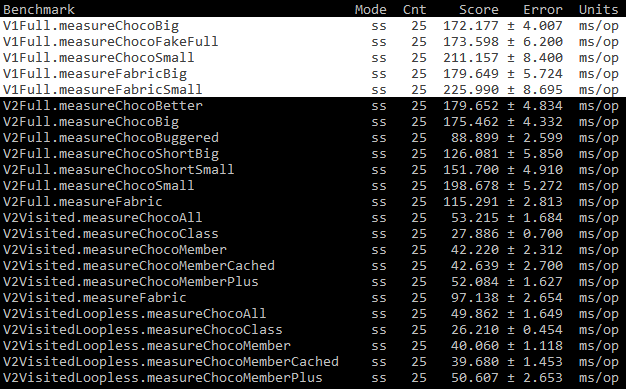

# Tiny Parser Benchmark
Benchmarking the speed of various parser implementations of the Tiny V1 and V2 mapping formats. Probably not totally reflective of the usage given the other overheads, such as reading the actual mapping files, but gives an idea at least of the CPU time involved in an implementation.

This repo includes a clone of [my fork](https://github.com/Chocohead/Tiny-Mappings-Parser) of [Fabric's Tiny-Mappings-Parser](https://github.com/FabricMC/tiny-mappings-parser) moved out of the Fabric package to avoid conflicts. Additional implementations or tweaks can (and probably will) be put in here for the sake of testing.

### Adding/Changing the Benchmarks
The benchmark project is build using [Jeka](https://jeka.dev). An Eclipse project can be generated with `eclipse#all` and an IntelliJ one `intellij#all`, either of which can be imported into an IDE for developing with, as the standard Jeka plugins allow. Subsequent changes to the project structure can be reflected via `eclipse#files` or `intellij#iml` as appropriate.

[JMH](https://openjdk.java.net/projects/code-tools/jmh) is used for the actual benchmarking implementation.

### Running the Benchmarks
First the benchmarks need to be compiled into a jar via `jekaw build`, then the resulting jar in `jeka/output` run (as a normal jar). Each benchmark is run 25 times so will take a couple of minutes to complete. The final outputted table contains the speed at which each benchmarked method took to run on average, representing the single invocation cost of an implementation.

There will be a drift between repeated runs as with all benchmarks, but the relative comparison should be fairly constant between the various tests.